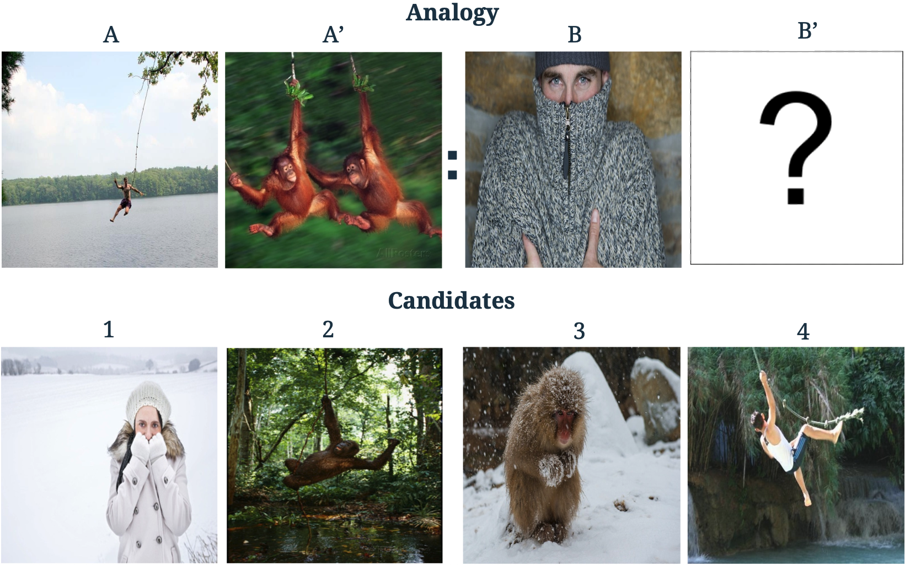

# VASR: Visual Analogies of Situation Recognition

Repository for the paper "VASR: Visual Analogies of Situation Recognition".  
Paper: https://arxiv.org/abs/2212.04542. 
Project website: https://vasr-dataset.github.io/.   
Huggingface integration + dataset card: https://huggingface.co/datasets/nlphuji/vasr.   
To create the dataset, enter the [dataset](dataset) directory.  
To run model experiments, enter the [experiments](experiments) directory.



## Setup
- Run:
    ```
    virtualenv venv --python=python3.7  
    source venv/bin/activate
    pip install -r requirements.txt
    export PYTHONPATH=$(pwd)/dataset:$(pwd)/experiments
    ```
- Run installation script:
    ```shell
    ./install.sh 
    ```

## Abstract
A core process in human cognition is \emph{analogical mapping}: the ability to identify a similar relational structure between different situations. We introduce a novel task, Visual Analogies of Situation Recognition, adapting the classical word-analogy task into the visual domain. Given a triplet of images, the task is to select an image candidate B' that completes the analogy (A to A' is like B to what?). Unlike previous work on visual analogy that focused on simple image transformations, we tackle complex analogies requiring understanding of scenes. 

We leverage situation recognition annotations and the CLIP model to generate a large set of 500k candidate analogies. Crowdsourced  annotations for a sample of the data indicate that humans agree with the dataset label ~80% of the time (chance level 25%). Furthermore, we use human annotations to create a gold-standard dataset of 3,820 validated analogies.
Our experiments demonstrate that state-of-the-art models do well when distractors are chosen randomly (~86%), but struggle with carefully chosen distractors (~53% compared to 90% human accuracy). We hope our dataset will encourage the development of new analogy-making models.
